# AI-Control

`AI-Control/` 是当前前端 E2E/CLI 的业务控制层。

**目标**

- 建立新的多层分工结构。
- 将「主菜单、子菜单、连接、分配、拍摄、保存」等动作拆成可独立调用的节点。
- 高层业务 flow 由这些细粒度步骤组合成流程网。

---

## 控制流程图

下图概括 **带恢复层的命令执行**（`core/commandExecutor.ts`）与 **`runFlow` 单步执行**（`core/flowRunner.ts`）。与「本地会话」配合时，外层可先 `GET /status` 再 `POST /run`，其内部仍落在此逻辑上。

```mermaid
flowchart LR
  E2E[E2E / Playwright] --> RFB["runFlowByCommand(...)\ncliFlows"]
  CLI[CLI 与脚本] --> RFB
  MCP[MCP / 会话服务] --> RFB
  RFB --> RCR["runCommandWithRecovery"]

  EPS["evaluatePageStatus(page)\nstatus/pageStatus"]
  PRS["planRecoverySteps(...)\nrecovery + commandRequirements"]
  GFC["getFlowCallsByCommand(...)\n命令名 → 核心 FlowStepCall[]"]

  RCR --> EPS
  EPS --> PRS
  EPS --> GFC
  PRS --> CHK{"recoveryPlan.blockers 中\n存在 resolution=reject ?"}
  GFC --> CHK

  CHK -->|是| FAIL["抛出：当前页面状态阻塞命令执行"]
  CHK -->|否| PRE{"preSteps 非空 ?"}
  PRE -->|是| RF1["runFlow(calls: preSteps)"]
  PRE -->|否| RF2["runFlow(calls: coreCalls)"]
  RF1 --> RF2

  subgraph rf["runFlow 内部（对每步循环）"]
    direction LR
    IDX["取下一步 FlowStepCall(id, params)"]
    MERGE["合并 globalParams + call.params"]
    LOOKUP["registry.get(id) → step.run(ctx, params)"]
    DELAY["可选 stepDelayMs"]
    IDX --> MERGE --> LOOKUP --> DELAY
    DELAY -->|"尚有 calls"| IDX
  end

  RF1 --> IDX
  RF2 --> IDX
```



- **规划**：先读 `PageStatus`，再得到 `recoveryPlan` 与 `coreCalls`；`preSteps` 与 `coreCalls` **均经同一 `runFlow`**，仅 `calls` 数组不同（先前置、后核心）。
- **阻塞**：若某 blocker 对该命令的策略为 **reject**，则**不执行**任何 `runFlow`，直接失败。
- **单步**：每步从 `StepRegistry` 取定义，失败时包装为带 `stepId` 的错误信息。

---

## 目录结构

| 目录 | 说明 |
|------|------|
| `core/` | 流程上下文、步骤类型、运行器与 registry 合并 |
| `shared/` | 交互原语、导航、guard、等待 |
| `atomic/` | 通用 UI 原子步骤 |
| `menu/` | 主菜单、子菜单、确认弹窗、设置入口。关闭主菜单时优先使用遮罩上的 `tb-act-toggle-navigation-drawer-overlay`（仅主菜单打开时存在） |

**子菜单状态判断与控制**（`menu/drawerSteps.ts` 中 `openDeviceSubmenu` / 步骤 `menu.device.open`）：

- **前置**：先确保主菜单抽屉已打开（`menu.drawer.open` / `ensureMenuDrawerOpen`），再根据状态决定是否点击设备项。
- **状态来源**：`ui-app-submenu-device-page` 的 `data-state`（open/closed）表示设备页是否打开；`ui-app-menu-device-${deviceType}` 的 `data-selected`（true/false）表示该设备是否当前选中。二者与前端 `App.vue` 中 `isOpenDevicePage`、`CurrentDriverType` 一致。
- **是否点击**：仅当「子菜单设备页已打开」且「目标设备项已选中」时跳过点击（幂等）；否则点击目标设备项 `ui-app-menu-device-${deviceType}`。
- **后置**：断言目标菜单项 `data-selected="true"`、`ui-app-submenu-drawer` 与 `ui-app-submenu-device-page` 均为 `data-state="open"`，保证二级抽屉与设备页均已就绪。
- **失败重试**：若后置断言超时（子菜单未变为 open），会重新执行「打开主菜单 → 点击设备项 → 等待子菜单 open」，最多共尝试 3 次（首次 + 2 次重试），每次重试前等待 400ms。
- **「再打开主菜单后卡住」原因与对策**：流程中会先打开主菜单与子菜单、再整体关闭（如 `menu.drawer.close`），随后再次打开主菜单以执行下一步（如 `applyCaptureConfig`）。**根因**：关闭主菜单时仅把 `nav`（showNavigationDrawer）设为 false，未同步重置子菜单状态；点击 overlay 可能被 Vuetify 视为“外部点击”从而将子菜单的 `drawer_2` 置为 false，但 `isOpenDevicePage` 仍为 true，导致 E2E 认为“子菜单已打开”而跳过点击，随后断言 `ui-app-submenu-drawer` 的 data-state=open 失败。**前端修复**：在 `App.vue` 中 watch `$store.state.showNavigationDrawer`，当主菜单关闭（isOpen 为 false）时同步执行 `drawer_2 = false`、`isOpenDevicePage = false`，保证再次打开主菜单后 E2E 会重新点击设备项并打开子菜单。E2E 侧对策：① 再次打开主菜单后固定等待约 600ms；② 设备项限定在 `ui-app-menu-drawer` 内查找并点击；③ 点击前滚入视口并短暂等待。
| `device/` | 设备侧栏、连接、分配、拍摄、QHY 别名 |
| `scenario/` | 面向 CLI 或 MCP 的高层业务 flow；`cliFlows.ts` 提供公开 CLI 命令与参数化业务流 |

**弹窗约定**：弹窗根节点与 `data-state` / `data-action` / `data-variant` 的定位与含义见 `apps/web-frontend/docs/dialog-identification.md`。网页整体结构目录见 `apps/web-frontend/docs/web-page-structure.md`。确认弹窗（gui.vue）类型由根节点 `data-action` 区分，按钮模型由 `data-variant` 区分，常量见 `shared/dialogConstants.ts`（如 `CONFIRM_ACTION.DISCONNECT_ALL_DEVICE`、`CONFIRM_DIALOG_VARIANT_AUTOFOCUS_MODE`）；步骤 `dialog.confirm.wait` / `confirm` / `cancel` 支持可选参数 `expectedAction` 以校验当前弹窗类型，`dialog.confirm.act` 支持按 `mode=confirm|cancel|coarse|fine` 自动分派按钮，适用于普通确认框与自动对焦确认框。另已补充 `dialog.disconnectDriver.wait` / `confirm` / `cancel`（单设备断开）、`dialog.disconnectAll.wait` / `confirm` / `cancel`（全部断开；可传 `allowMissing=true` 兼容“无设备连接时不弹框”）与 `dialog.imageManager.wait` / `confirm` / `cancel`（图像管理确认类弹层，通过 `dialog` 指定 `usbConfirm` / `deleteConfirm` / `downloadConfirm` / `downloadLocationReminder`）。**单设备断开入口**来自设备子菜单底部固定按钮 `ui-app-btn-disconnect-driver`（`App.vue` 中 `@click="disconnectDriver"`），点击后会触发单设备确认框 `ui-app-disconnect-driver-dialog-root`，不应依赖不稳定的 DOM Path/class 链。**全部断开入口**来自主菜单 `ui-app-menu-disconnect-all`（`App.vue` 中 `@click.stop="disconnectAllDevice(false)"`），其确认框实际仍是通用 `gui.vue` 确认弹窗；由于前端仅在 `haveDeviceConnect=true` 时才会弹框，无设备时不会出现确认框。

---

## 执行约定与操作步骤

通过 `runFlowByCommand(ctx, registry, commandName, flowParams?, options?)` 或 `getFlowCallsByCommand(commandName, flowParams)` 使用。列出全部命令：`listCliCommands()`。

### 默认前置条件

- 浏览器页面已打开，且 `E2E_BASE_URL` 指向可访问的前端页面。
- 若希望 AI、终端与脚本共用同一网页，优先保证本机会话已启动，并且本机可访问 `http://127.0.0.1:39281`。
- 所有命令默认不刷新页面；若需要先回首页再执行，显式传 `gotoHome: true` 或设置 `E2E_GOTO_HOME=1`。
- 会话 HTTP 只发到本机 `127.0.0.1`；不要从另一台机器通过局域网 IP 访问本地会话端口。

### 指定设备 IP（局域网前端）

控制树莓派 / 盒子等设备上的 QUARCS 前端时，用环境变量 **`E2E_BASE_URL`** 指定浏览器要打开的页面根地址（与 Playwright `baseURL` 一致）。常见形式为 **`http://<设备IP>:8080`**，端口以设备上实际服务为准。

**本地会话**（`apps/web-frontend` 下 `npm run e2e:ai-control:session`，对应 `scripts/ai-control-session.ts`）会按 `E2E_BASE_URL` 打开页面，并在本机 **`127.0.0.1:39281`** 提供 `GET /status`、`POST /run`。控制逻辑仍走本机会话端口，只是页面加载目标改为指定 IP。

示例（设备 `192.168.1.104`、前端端口 `8080`）：

```bash
cd apps/web-frontend
E2E_BASE_URL=http://192.168.1.104:8080 npm run e2e:ai-control:session
```

可选环境变量（与脚本一致）：`E2E_HEADED=0` 无头浏览器；`E2E_AI_CONTROL_SESSION_PORT` 改会话 HTTP 端口；`E2E_AI_CONTROL_RUN_TIMEOUT_MS` 调整单次 `POST /run` 默认超时；`E2E_AI_CONTROL_SESSION_NO_KILL_STALE=1` 跳过启动前占用端口的清理。

在 **后台或非交互**环境启动同一会话时，若标准输入立即 EOF，进程会随 `readline` 结束而退出。需保持 stdin 打开，例如：

```bash
(while true; do sleep 3600; done) | E2E_BASE_URL=http://192.168.1.104:8080 E2E_HEADED=0 npm run e2e:ai-control:session
```

跑 **Playwright AI-Control 用例**（非会话 HTTP）时，同样用 `E2E_BASE_URL` 指向设备；仓库内 `scripts/ai-control-e2e-target.sh` 默认 `http://192.168.1.104:8080`，可被覆盖：

```bash
E2E_BASE_URL=http://192.168.1.113:8080 bash scripts/ai-control-e2e-target.sh
```

未设置 `E2E_BASE_URL` 时，`ai-control-session` 内置默认见 `scripts/ai-control-session.ts` 源码；以显式设置为准可避免误连错误设备。

### 默认执行顺序

1. 先检查是否可以读取本地会话状态：调用 `GET /status`，或在知道命令名时调用 `GET /status?command=xxx`。
2. 只要可以获取到本地会话状态，就默认使用本地会话方式执行：先读状态与恢复计划，再通过 `POST /run` 执行命令。
3. 若无法获取本地会话状态，再启动或恢复会话；会话启动后，仍先读取 `/status`，确认页面已可控，再执行命令。
4. 仅在明确不使用本地会话、或在代码 / Playwright 场景内嵌调用时，才直接走 `createFlowContextForSession` / `createFlowContext` + `runFlowByCommand(...)`。

### 本地会话执行规则

- `GET /status`：读取当前 UI 状态，包括主页面、菜单抽屉、弹窗、设备、busy 状态、overlay 等；其中 `capture.e2eExposureCompletedSeq` / `capture.e2eTileGpmSeq` 与隐藏探针 `e2e-exposure-completed` / `e2e-tilegpm` 的 `data-seq` 一致，便于轮询诊断。
- `GET /status?command=xxx`：除读取状态外，还返回该命令的 `targetSurface`、`blockers`、`preSteps`、`coreStepIds`、`suggestions`。
- `POST /run`：恢复层会先读取状态，再执行前置恢复步骤与命令核心 flow。

### 恢复层与前置检查

命令真正执行前，恢复层会先做前置检查与收敛，典型包括：

- 关闭残留确认框。
- 关闭图像管理、电源管理、任务计划表、极轴校准等阻挡界面。
- 清理 overlay。
- 根据 busy 策略决定等待、取消或拒绝。

busy 策略概览如下：

| busy 状态 | 策略 | 典型命令 |
|-----------|------|----------|
| `capture` | `wait / reject` | `maincamera-connect-capture`、`cfw-capture-config` 为 `wait`；其余大多数命令为 `reject` |
| `guiding` | `cancel` | 大多数会切页或改配置的命令都会先停止导星，再继续执行 |
| `polarAxis` | `cancel` | 非极轴命令遇到正在运行的极轴校准，会先停止并关闭极轴组件 |
| `deviceAllocation` | `cancel` | 命令切换时会优先关闭残留设备分配面板，而不是死等 |

### 命令操作步骤总览

#### `general-settings`

前置条件：

- 页面可进入首页，且通用设置入口可见。
- 若传 `resetBeforeConnect: true`，允许在有设备连接时处理“断开全部”确认框。

操作步骤：

1. 可选 `gotoHome`。
2. 可选执行 `disconnect-all` 风格的前置断开。
3. 打开通用设置对话框。
4. 若传 `generalSettingsInteract`，按顺序执行页签切换、勾选/还原、语言切换、刷新、清理盒子与关闭。

#### `disconnect-all`

前置条件：

- 主菜单可打开。

操作步骤：

1. 可选 `gotoHome`。
2. 打开主菜单。
3. 点击 `ui-app-menu-disconnect-all`。
4. 若存在已连接设备，则确认断开；若无设备连接，则直接跳过弹窗链路。

#### `device-disconnect`

前置条件：

- 已知目标 `deviceType`。
- 对应设备子菜单可打开。

操作步骤：

1. 可选 `gotoHome`。
2. 打开目标设备子菜单。
3. 点击底部断开按钮 `ui-app-btn-disconnect-driver`。
4. 处理单设备确认框 `ui-app-disconnect-driver-dialog-root`。
5. 等待目标设备探针变为 `disconnected`。

#### `power-management`

前置条件：

- 电源管理入口可达。
- 若会触发重启 / 关机 / 强制更新，允许处理对应确认框。

操作步骤：

1. 可选 `gotoHome`。
2. 打开电源管理页。
3. 按 `powerManagementInteract` 依次切换输出电源或处理重启 / 关机 / 更新动作。
4. 以输出状态变化或确认框关闭作为完成判定。

#### `switch-to-guider-page`

前置条件：

- 主页面切换按钮 `gui-btn-switch-main-page` 可见且可点击。

操作步骤：

1. 可选 `gotoHome`。
2. 关闭主菜单抽屉。
3. 点击页面切换按钮，直到主页面为 `GuiderCamera`。
4. 断言导星图表面板 `ui-chart-component-root` 可见。

#### `guider-connect-capture`

前置条件：

- 导星设备真实在线，或允许在等待连接时超时失败。
- 若有设备分配面板，允许执行绑定。

操作步骤：

1. 可选 `gotoHome`。
2. 可选先断开当前 Guider。
3. 检查导星设备探针状态；若未连接则打开子菜单、选择驱动与连接模式并执行连接。
4. 若出现设备分配面板，按需绑定。
5. 等待导星设备连接成功。
6. 按参数设置导星菜单项。
7. 切到导星页面，按 `guiderInteract` 执行循环曝光、导星、曝光档位、清图、量程切换或重新校准。

#### `maincamera-connect-capture`

前置条件：

- 主相机真实在线，或允许在等待连接时超时失败。
- 若计划执行拍摄，主相机面板与拍摄按钮可用。

操作步骤：

1. 可选 `gotoHome`。
2. 可选先断开当前 MainCamera。
3. 检查主相机设备探针状态；若未连接则打开子菜单、选择驱动与连接模式并执行连接。
4. 若出现设备分配面板，按需绑定。
5. 等待主相机连接成功。
6. 若传入拍摄配置参数，则应用主相机菜单中的拍摄相关配置。
7. 当 `doCapture !== false` 时，打开拍摄面板并执行 `device.captureOnce`；`captureCount > 1` 时重复执行。每次点击拍摄前，步骤会等待 `cp-btn-capture` 根节点 **`data-capture-ready=true`**（与 `CircularButton.vue` 中「可再次触发 `takeExposure`」一致，避免上一帧完成后尚未解锁时连点无效）。
8. 当 `doSave === true` 时，在拍摄完成后执行保存流程。

#### `mount-connect-control`

前置条件：

- 赤道仪真实在线，或允许在等待连接时超时失败。
- 允许在连接完成后操作 Mount 侧栏。

操作步骤：

1. 可选 `gotoHome`。
2. 可选先断开当前 Mount。
3. 打开 Mount 侧栏，选择驱动与连接模式并连接。
4. 若出现设备分配面板，按需绑定。
5. 等待 Mount 连接成功。
6. 若传 `mountControlInteract`，在侧栏内执行按钮点击或开关设置。
7. 关闭抽屉。
8. 若传 `ensurePark: true`，继续确保主界面 Park 为 `on`。

#### `mount-park`

前置条件：

- 满足 `mount-connect-control` 的连接前提。
- 主界面赤道仪控制面板允许被打开。

操作步骤：

1. 先完成与 `mount-connect-control` 相同的连接流程。
2. 打开主界面赤道仪控制面板。
3. 若 `mcp-btn-park` 的 `data-state` 不为 `on`，则点击直至为 `on`。
4. 若传 `mcpInteract`，继续执行主面板交互。

#### `mount-panel`

前置条件：

- 主界面赤道仪控制面板入口可达。

操作步骤：

1. 可选 `gotoHome`。
2. 打开主界面赤道仪控制面板。
3. 若传 `mcpInteract`，执行 `park`、`track`、`home`、`stop`、`sync`、`solve` 或方向移动。

#### `telescopes-focal-length`

前置条件：

- `Telescopes` 子菜单可打开。
- 焦距输入框 `ui-config-Telescopes-FocalLengthmm-number-0` 可交互。

操作步骤：

1. 可选 `gotoHome`。
2. 打开 `Telescopes` 子菜单。
3. 在焦距输入框中填入目标值。

#### `focuser-connect-control`

前置条件：

- 电调设备真实在线，或允许在等待连接时超时失败。
- 允许在连接完成后操作速度、ROI、移动、校准与自动对焦控件。

操作步骤：

1. 可选 `gotoHome`。
2. 可选先断开当前 Focuser。
3. 打开 Focuser 侧栏，选择驱动与连接模式并连接。
4. 若出现设备分配面板，按需绑定。
5. 等待 Focuser 连接成功。
6. 按 `focuserInteract` 依次执行速度切换、ROI 切换、手动移动、循环拍摄、校准与自动对焦相关动作。

#### `cfw-capture-config`

前置条件：

- 主相机已可连接并能打开拍摄面板。
- 若需要菜单级滤镜切换，CFW 菜单入口可达。

操作步骤：

1. 可选 `gotoHome`。
2. 可选先断开当前 MainCamera。
3. 连接主相机并完成设备分配。
4. 打开拍摄面板。
5. 按 `cfwInteract` 执行拍摄面板 `+/-` 与菜单 `CFWNext/CFWPrev`。

#### `polar-axis-calibration`

前置条件：

- 极轴校准入口可达。

操作步骤：

1. 可选 `gotoHome`。
2. 打开极轴校准页。
3. 按 `polarAxisInteract` 依次执行自动校准、测试模拟、折叠、轨迹层控制、最小化、窗口模式切换与退出。

#### `image-file-manager`

前置条件：

- 图像管理面板入口可达。
- 若执行 `moveToUsb` / `delete` / `download`，需满足界面前置（已选文件/文件夹、USB 可用等）；可通过 `imageManagerInteract` 中的 `openFolderIndex`、`selectAllInOpenFolder` 先选中再删。
- 弹窗类参数（`*ConfirmDialog`）为可选；不设则**不**自动点确认（与旧版兼容），设 `true` 或 `'confirm'` / `'cancel'` 则调用 `dialog.imageManager.confirm` / `cancel`（见 `scenario/imageManagerCliFlow.ts`）。

操作步骤：

1. 可选 `gotoHome`。
2. 打开图像管理面板。
3. 按 `imageManagerInteract` 展开步骤：可选 `openFolderIndex` → 可选 `selectAllInOpenFolder` → `moveToUsb`（可选 `usbSelectIndex`、`usbTransferConfirmDialog`）→ `delete`（可选 `deleteConfirmDialog`）→ `download`（可选 `downloadConcurrency`、`downloadConfirmDialog`、`downloadLocationReminderDialog`）→ `imageFileSwitch` → `refresh` → `panelClose`。

#### `task-schedule`

前置条件：

- 工具栏 `tb-btn-toggle-schedule-panel` 可点击。
- 若涉及预设操作，允许打开内嵌预设对话框。

操作步骤：

1. 可选 `gotoHome`。
2. 打开任务计划表。
3. 按既定顺序执行 `selectRow`、左侧栏折叠 / 展开、增删行、开始 / 暂停、保存预设、加载预设、关闭预设对话框、关闭面板。
4. 若左侧栏被折叠，流程会先自动展开再执行依赖按钮的动作。

---

## 源码变更后的版本号与部署

修改 **前端**（`apps/web-frontend`）或 **Qt 服务端**（`QUARCS_QT-SeverProgram`）业务代码后，必须同步 bump 客户端版本字符串，便于设备端区分构建、触发更新检查；**只改 AI-Control / E2E 且未动运行时代码时，可按团队约定决定是否 bump**。

| 侧 | 修改位置 | 宏/字段 |
|----|----------|---------|
| 前端 | `apps/web-frontend/src/App.vue` | `VueClientVersion`（`data()` 内手动字符串） |
| Qt 后端 | `QUARCS_QT-SeverProgram/src/mainwindow.h` | `#define QT_Client_Version "..."` |

### 更新前置条件

- 先确认本次修改是否触及前端或 Qt 运行时代码，决定是否需要 bump 版本号。
- 先确认目标设备地址、上传权限、交叉编译环境与工具链可用。
- 若后续要做在线验证，默认先检查本地会话状态；只要 `GET /status` 可用，就优先通过本地会话执行更新前后的验证动作。
- Qt 更新后需要通过前端电源管理执行 `restartQtServer`，因此更新前应确认前端页面可访问且电源管理入口可用。

### 版本号规则

- 主版本为 **当天日期**，格式 `YYYYMMDD`（与仓库内现有写法一致，如 `20260323`）。
- 若 **同一天内再次** 因源码变更需要发布：在日期后追加 **`-` + 当日第几次修改**，例如第二次为 `20260323-2`，第三次为 `20260323-3`（第一次仍用纯 `YYYYMMDD`）。

### 更新 / 发布步骤

1. 按上表修改对应仓库中的版本常量。
2. 统一使用 `apps/web-frontend/scripts/quarcs-publish.sh` 完成构建与上传，不再手写分散的 `kill_run.sh`、`cmake`、`upload.py` 命令。
3. 根据本次发布目标选择前端、Qt 或前端 + Qt 的发布组合。
4. 若发布 Qt，脚本会在 `QUARCS_QT-SeverProgram/src/BUILD` 执行交叉编译，默认工具链为 `toolchain-rpi-arm64.cmake`。
5. 脚本上传完成后，按生效方式完成更新收口：
   - 前端：刷新浏览器页面，必要时硬刷新。
   - Qt：在电源管理中执行 **重启 QUARCS 服务端**（`data-action=restartQtServer`）。
6. 若本地会话可用，更新完成后再次读取 `/status`，并在同一会话页完成必要的功能确认。

### 发布脚本说明

脚本路径：

```bash
/home/quarcs/workspace/QUARCS/QUARCS_stellarium-web-engine/apps/web-frontend/scripts/quarcs-publish.sh
```

已封装能力：

- **前端发布**：内部以 `ENGINE_UPDATE=0/1 BUILD_ONLY=1 bash kill_run.sh` 方式构建 `dist/`，不会在“仅出包”场景常驻启动预览服务。
- **Qt 发布**：内部在 `QUARCS_QT-SeverProgram/src/BUILD` 执行交叉编译。
- **上传更新包**：内部固定调用 `/home/quarcs/workspace/QUARCS/upload.py` 上传到目标设备。

**前端「编译」具体包含什么（避免与文档歧义）**

| 步骤 | 默认（`quarcs-publish.sh … --vue`，不加 `--engine-update`） | 说明 |
| --- | --- | --- |
| Vue 生产构建 | **会执行** | `kill_run.sh` 内 `vue-cli-service build`，产出 `apps/web-frontend/dist/`。 |
| 引擎 wasm / `update-engine` | **不执行** | `ENGINE_UPDATE=0`，跳过 `stellarium-web-engine` 的 wasm 更新（耗时较长，且常需 docker 等环境）。若改了引擎侧，需加 **`--engine-update`**。 |
| 本地预览服务 | **不启动** | `BUILD_ONLY=1` 只出包不上线 8080/9090。 |
| Qt 服务端 | **不编译** | 仅 `--qt` 或 `--vue --qt` 时才会在 Qt 仓库里交叉编译。 |

常用选项：

- `--engine-update`：前端构建前执行引擎 wasm 更新（默认等价 `ENGINE_UPDATE=0`）。
- `--skip-vue-build`：只上传前端，跳过前端构建。
- `--skip-qt-build`：只上传 Qt，跳过 Qt 编译。
- `--workers N`：设置上传并发数。
- `--relax-upload-filter`：放宽上传过滤。
- `--cmake-sysroot PATH`：为 Qt 交叉编译追加 `-DCMAKE_SYSROOT=PATH`。

**说明**：`gui.vue` 等处的 `process.env.VUE_APP_VERSION` 与 `App.vue` 中展示的 `VueClientVersion` 可能不一致；以 **手动维护的 `VueClientVersion` / `QT_Client_Version`** 作为与监控进程、版本展示对齐的约定为准。

---

## CLI 命令总览

| 命令名 | 说明 |
|--------|------|
| `general-settings` | 打开通用设置对话框 |
| `disconnect-all` | 独立执行“断开全部设备” |
| `device-disconnect` | 按 `deviceType` 独立断开单个设备 |
| `power-management` | 打开电源管理页，并按参数切换输出电源 / 重启 / 关机 / 强制更新 |
| `switch-to-guider-page` | 仅切换到导星界面 |
| `guider-connect-capture` | 导星镜连接与导星专用控制 |
| `maincamera-connect-capture` | 主相机连接，并按参数决定是否拍摄 |
| `mount-connect-control` | 赤道仪连接与控制 |
| `mount-park` | 赤道仪连接并确保 Park 为 on |
| `mount-panel` | 打开主界面赤道仪面板并执行 `mcpInteract` |
| `telescopes-focal-length` | 望远镜焦距设置 |
| `focuser-connect-control` | 电调连接与控制 |
| `cfw-capture-config` | 滤镜轮：主相机连接后执行拍摄面板和菜单级滤镜切换 |
| `polar-axis-calibration` | 打开极轴校准页面并执行组件内交互 |
| `image-file-manager` | 打开图像管理面板 |
| `task-schedule` | 任务计划表 |

---

## 参数说明

### 通用参数

| 参数 | 说明 |
|------|------|
| `gotoHome` | 是否先刷新页面，默认 `false`。 |
| `deviceType` | 单设备命令目标设备；当前用于 `device-disconnect`，可选值 `MainCamera`、`Guider`、`Mount`、`Focuser`、`Telescopes`、`CFW`。 |
| `resetBeforeConnect` | 是否先断开当前命令目标设备，默认 `false`；设备类命令走单设备断开按钮 `ui-app-btn-disconnect-driver`，不是 `disconnectAll`。 |
| `driverText` | 驱动文案，须与下拉展示一致。 |
| `connectionModeText` | 连接模式，如 `SDK`、`INDI`。 |
| `doBindAllocation` | 是否在出现设备分配面板时自动绑定，默认 `true`。 |
| `allocationDeviceMatch` | 设备分配时优先匹配的设备名称片段（列表项展示名 **包含** 该片段即选中，**忽略大小写**，空白会规范化后再比较）。 |
| `devices` | 多设备 **依次连接**（`device.connectIfNeeded` 内与 `connectionSteps` 的 `devices` 一致）。每项：`deviceType`、`driverText?`、`connectionModeText?`、`allocationDeviceMatch?`。用于 `guider-connect-capture`、`maincamera-connect-capture`；若设置则优先于本表中单设备的 `driverText` / `allocationDeviceMatch` / 默认 `deviceType`。`resetBeforeConnect` 为 `true` 时按数组顺序对各 `deviceType` 执行断开再连接。 |

### 设备分配：模糊匹配与导星默认

- **模糊匹配**：`allocationDeviceMatch` 或 `devices[].allocationDeviceMatch` 只需与列表中的设备展示名 **部分一致**（子串），例如 `minicam8`、`462`。
- **导星默认（5III）**：当绑定 **导星（Guider）**、列表中 **多于一台** 相机、且 **未指定** `allocationDeviceMatch` 时，自动优先选择名称中含 **`5III`** 的项（与 QHY5III 系列一致）；若无则选第一项。

环境变量 `E2E_DEVICES_JSON` 可传入与 `devices` 相同的 JSON 数组，便于 E2E 无改代码注入，例如：

```json
[{"deviceType":"MainCamera","allocationDeviceMatch":"minicam8"},{"deviceType":"Guider","allocationDeviceMatch":"462"}]
```

### `general-settings`

| 参数名 | 类型 | 默认值 | 控制功能 |
|--------|------|--------|----------|
| `gotoHome` | `boolean` | `false` | 是否先刷新页面（`device.gotoHome`）；不传则在当前页执行。 |
| `resetBeforeConnect` | `boolean` | `false` | 是否在执行前先断开全部设备（有设备连接时会弹出确认框）。 |
| `generalSettingsInteract` | `Partial<Record<GeneralSettingsInteractKey, boolean>>` | 未传则全部 `true` | 按项开关：仅其中为 `true` 的 key 会执行；未传则所有交互项均为 `true`。 |
| `generalSettingsRestoreAfterMs` | `number` | `1000` | 交互后等待多少毫秒再还原（仅对可还原项生效）。 |
| `clearBoxConfirmOption` | `'cache' \| 'update-pack' \| 'backup'` | `'cache'` | `clearBoxConfirm` 时只勾选哪一项。 |
| `clearBoxConfirmOptions` | `Array<'cache' \| 'update-pack' \| 'backup'>` | — | 勾选多项；若传则优先于 `clearBoxConfirmOption`。 |
| `generalSettingsLanguageItemText` | `string` | `'Simplified Chinese'` | 语言下拉要切换到的选项文案。 |
| `generalSettingsLanguageRestoreItemText` | `string` | — | 语言切换后是否再切回该项。 |

`generalSettingsInteract` 可用 key：

| key | 控制功能 |
|-----|----------|
| `displayTab` | 切换到 **Display** 页签。 |
| `milkyWay` | 银河层开关：勾选 / 还原复选框。 |
| `dss` | DSS 层开关：勾选 / 还原复选框。 |
| `meridian` | 子午线开关：勾选 / 还原复选框。 |
| `ecliptic` | 黄道线开关：勾选 / 还原复选框。 |
| `highfps` | 高帧率开关：勾选 / 还原复选框。 |
| `selectLanguage` | Display 页签内语言下拉切换。 |
| `versionTab` | 切换到 **Version Info** 页签。 |
| `refreshDevices` | 点击“刷新设备版本”按钮。 |
| `memoryTab` | 切换到 **Memory** 页签。 |
| `refreshStorage` | 点击“刷新存储”按钮。 |
| `clearLogs` | 点击“清除日志”按钮。 |
| `clearBoxCancel` | 打开清理盒子缓存弹窗，然后点击取消。 |
| `clearBoxConfirm` | 再次打开清理盒子弹窗，按选项勾选后点击确认。 |
| `close` | 关闭通用设置对话框。 |

环境变量：

| 环境变量 | 对应参数 | 说明 |
|----------|----------|------|
| `E2E_GENERAL_SETTINGS_INTERACT` | `generalSettingsInteract` | 逗号分隔的 key，仅这些项为 `true`。 |
| `E2E_CLEAR_BOX_OPTION` | `clearBoxConfirmOption` | 清理盒子时只勾选哪一项。 |
| `E2E_GENERAL_SETTINGS_LANGUAGE_ITEM_TEXT` | `generalSettingsLanguageItemText` | 语言下拉要切换到的选项文案。 |
| `E2E_GENERAL_SETTINGS_LANGUAGE_RESTORE_ITEM_TEXT` | `generalSettingsLanguageRestoreItemText` | 语言切换后还原的选项文案。 |
| `E2E_GENERAL_SETTINGS_RESTORE_AFTER_MS` | `generalSettingsRestoreAfterMs` | 交互后等待多少毫秒再还原。 |
| `E2E_RESET_BEFORE_CONNECT` | `resetBeforeConnect` | 是否先断开全部再打开设置。 |
| `E2E_GOTO_HOME` | `gotoHome` | 是否先刷新页面。 |
| `E2E_FLOW_PARAMS_JSON` | 整份 `CliFlowParams` | 完整 flowParams JSON。 |

### `disconnect-all`

| 参数名 | 类型 | 默认值 | 说明 |
|--------|------|--------|------|
| `gotoHome` | `boolean` | `false` | 是否先刷新页面。 |

### `device-disconnect`

| 参数名 | 类型 | 默认值 | 说明 |
|--------|------|--------|------|
| `gotoHome` | `boolean` | `false` | 是否先刷新页面。 |
| `deviceType` | `'MainCamera' \| 'Guider' \| 'Mount' \| 'Focuser' \| 'Telescopes' \| 'CFW'` | 必填 | 要断开的目标设备类型。 |

### `power-management`

| 参数名 | 类型 | 默认值 | 说明 |
|--------|------|--------|------|
| `gotoHome` | `boolean` | `false` | 是否先刷新页面。 |
| `powerManagementInteract.output1` | `boolean` | — | 将输出电源 1 设为目标状态；`true`=开，`false`=关。 |
| `powerManagementInteract.output2` | `boolean` | — | 将输出电源 2 设为目标状态；`true`=开，`false`=关。 |
| `powerManagementInteract.restartQuarcsServer` | `true \| 'confirm' \| 'cancel'` | — | 点击“重启 QUARCS 服务端”。 |
| `powerManagementInteract.restart` | `true \| 'confirm' \| 'cancel'` | — | 点击树莓派“重启”。 |
| `powerManagementInteract.shutdown` | `true \| 'confirm' \| 'cancel'` | — | 点击关机。 |
| `powerManagementInteract.forceUpdate` | `true \| 'confirm' \| 'cancel'` | — | 点击强制更新。 |

成功判定：

- 输出电源切换：列表文本从 `[OFF]` 变为 `[ON]` 或从 `[ON]` 变为 `[OFF]`。
- 重启 / 关机 / 强制更新相关动作：确认或取消动作已执行，对应确认弹窗已关闭。

环境变量：

- 通用：`E2E_GOTO_HOME`、`E2E_FLOW_PARAMS_JSON`
- 电源管理：`E2E_POWER_MANAGEMENT_INTERACT`
- `E2E_POWER_MANAGEMENT_INTERACT` 支持值：`output1-on`、`output1-off`、`output2-on`、`output2-off`、`restart-quarcs-confirm`、`restart-quarcs-cancel`、`restart-confirm`、`restart-cancel`、`shutdown-confirm`、`shutdown-cancel`、`force-update-confirm`、`force-update-cancel`

### `switch-to-guider-page`

| 参数名 | 类型 | 默认值 | 说明 |
|--------|------|--------|------|
| `gotoHome` | `boolean` | `false` | 是否先刷新页面。 |

### 设备连接类命令默认驱动 / 模式

- `Mount` 默认 `EQMod / INDI`
- `MainCamera`、`Guider` 默认 `QHY CCD / SDK`
- `Focuser` 默认 `Focuser / INDI`

### `guider-connect-capture`

| 参数名 | 类型 | 默认值 | 说明 |
|--------|------|--------|------|
| `gotoHome` | `boolean` | `false` | 是否先刷新页面。 |
| `resetBeforeConnect` | `boolean` | `false` | 是否先断开 `Guider` 设备。 |
| `driverText` | `string` | `'QHY CCD'` | 驱动文案。 |
| `connectionModeText` | `string` | `'SDK'` | 连接模式。 |
| `doBindAllocation` | `boolean` | `true` | 是否自动设备分配。 |
| `allocationDeviceMatch` | `string` | — | 指定设备分配优先匹配文案。 |
| `guiderFocalLengthMm` | `string` | — | 导星菜单中的焦距。 |
| `guiderMultiStar` | `boolean` | — | 是否开启多星导星。 |
| `guiderGain` | `number` | — | 导星 Gain 滑块数值。 |
| `guiderOffset` | `number` | — | 导星 Offset 滑块数值。 |
| `guiderRaDirection` | `string` | — | RA 单步导星方向：`AUTO` / `WEST` / `EAST`。 |
| `guiderDecDirection` | `string` | — | DEC 单步导星方向：`AUTO` / `NORTH` / `SOUTH`。 |
| `guiderExposure` | `number \| string` | — | 导星面板曝光档位，仅支持 `500ms`、`1s`、`2s`。 |
| `guiderInteract.loopExposure` | `boolean` | — | 设置导星循环曝光开关。 |
| `guiderInteract.guiding` | `boolean` | — | 设置导星开关。 |
| `guiderInteract.expTime` | `number \| string` | — | 与 `guiderExposure` 等价的面板曝光档位控制。 |
| `guiderInteract.dataClear` | `boolean` | — | 点击导星数据清空按钮。 |
| `guiderInteract.rangeSwitch` | `boolean` | — | 点击导星图表量程切换按钮。 |
| `guiderInteract.recalibrate` | `boolean` | — | 长按导星按钮并确认重新校准。 |

补充说明：

- `guider-connect-capture` 现已支持导星镜连接、设备分配匹配、导星菜单参数设置，以及导星页图表面板控制。
- 旧的主相机拍摄型参数 `doSave` / `captureCount` / `waitCaptureTimeoutMs` 不适用于该命令。
- `captureExposure` 仅作为 `guiderExposure` 的兼容别名保留。

环境变量：

- `E2E_GOTO_HOME`
- `E2E_RESET_BEFORE_CONNECT`
- `E2E_FLOW_PARAMS_JSON`
- `E2E_DO_BIND_ALLOCATION`
- `E2E_ALLOCATION_DEVICE_MATCH`
- `E2E_GUIDER_FOCAL_LENGTH_MM`
- `E2E_GUIDER_MULTI_STAR`
- `E2E_GUIDER_GAIN`
- `E2E_GUIDER_OFFSET`
- `E2E_GUIDER_RA_DIRECTION`
- `E2E_GUIDER_DEC_DIRECTION`
- `E2E_GUIDER_EXPOSURE`
- `E2E_GUIDER_INTERACT_JSON`

### `maincamera-connect-capture`

| 参数名 | 类型 | 默认值 | 说明 |
|--------|------|--------|------|
| `gotoHome` | `boolean` | `false` | 是否先刷新页面。 |
| `resetBeforeConnect` | `boolean` | `false` | 是否先断开 `MainCamera` 设备。 |
| `driverText` | `string` | `'QHY CCD'` | 驱动文案。 |
| `connectionModeText` | `string` | `'SDK'` | 连接模式。 |
| `doBindAllocation` | `boolean` | `true` | 是否自动设备分配。 |
| `allocationDeviceMatch` | `string` | — | 设备分配优先匹配文案。 |
| `doCapture` | `boolean` | `true` | 是否执行拍摄；为 `false` 时仅连接 / 配置。 |
| `doSave` | `boolean` | `false` | 是否保存结果；仅在 `doCapture=true` 时生效。 |
| `captureCount` | `number` | `1` | 拍摄次数。 |
| `captureReadyTimeoutMs` | `number` | — | 等待拍摄按钮 **`data-capture-ready=true`** 的最长时间（毫秒）。未传时取 `max(30000, stepTimeoutMs)`。用于连拍时与按钮解锁对齐；若页面无该属性（旧版前端），步骤不阻塞。 |
| `waitCaptureTimeoutMs` | `number` | — | 无法从 `captureExposure` 或面板解析曝光时的回退超时（毫秒）；默认可由 `device.captureOnce` 分两段：cp-status 为「曝光 + 60s」，`e2e-tilegpm` 的 `data-seq` 为「曝光 + 120s」（TileGPM 可能晚于 idle）。 |
| `captureGain` | `number` | — | 增益。 |
| `captureOffset` | `number` | — | 偏置。 |
| `captureCfaMode` | `string` | — | CFA 模式：`'GR'`、`'GB'`、`'BG'`、`'RGGB'`、`'null'`。 |
| `captureTemperature` | `number \| string` | — | 制冷温度。 |
| `captureAutoSave` | `boolean` | — | 是否开启自动保存。 |
| `captureSaveFailedParse` | `boolean` | — | 是否保存解析失败图片。 |
| `captureSaveFolder` | `string` | — | 保存文件夹选项文案。 |
| `captureExposure` | `string` | — | 曝光时间，需在拍摄面板预设内。 |

拍摄流程补充：

- 流程为：设备已连接 → `capture.panel.ensureOpen` → `device.captureOnce`（可多次）→ 可选 `device.save`。
- 当 `doCapture=false` 时，会跳过 `device.captureOnce` 与 `device.save`，仅保留连接 / 配置链路。
- **拍摄按钮与连拍**：`cp-btn-capture` 所在根节点带 **`data-capture-ready`**（`true` / `false`），与 `CircularButton.vue` 内 `isClicked`、`isButtonDisabled`、`isLongPress` 对齐；收到 `ExposureCompleted` 后约 **500ms** 会 `resetProgress` 解锁（再点拍保护时长，以源码为准）。`device.captureOnce` 在每次点击前会轮询直至 `data-capture-ready=true`（或探针缺失时跳过等待），再读取 `exp/tile` 并点击。
- `device.captureOnce`：**成功判定**以 Qt 下行 `ExposureCompleted` 驱动的探针 `e2e-exposure-completed`（`data-seq`）与 `e2e-tilegpm`（TileGPM）**任一前进**为准（短曝光时 `cp-status` busy 可能一闪而过，不宜作为唯一依据）；`cp-status→idle` 仅尽力等待。旧版仅 TileGPM 时仍可用 tile 探针。
- 运行器会为每步注入 `__flowStepIndex` / `__flowStepTotal`（仅 `runFlow` 合并参数）；`device.captureOnce` 会打 `[flow i/n]`、点击前后探针与 `cp-status`；失败时输出 `exp/tile` 前后值。

环境变量：

- `E2E_DO_CAPTURE`
- `E2E_CAPTURE_GAIN`
- `E2E_CAPTURE_OFFSET`
- `E2E_CAPTURE_CFA_MODE`
- `E2E_CAPTURE_TEMPERATURE`
- `E2E_CAPTURE_AUTO_SAVE`
- `E2E_CAPTURE_SAVE_FAILED_PARSE`
- `E2E_CAPTURE_SAVE_FOLDER`
- `E2E_CAPTURE_EXPOSURE`
- `E2E_CAPTURE_COUNT`
- `E2E_WAIT_CAPTURE_TIMEOUT_MS`
- `E2E_CAPTURE_READY_TIMEOUT_MS`：对应 `captureReadyTimeoutMs`，等待 `data-capture-ready=true` 的上限（毫秒）。

### `focuser-connect-control`

| 参数名 | 类型 | 默认值 | 说明 |
|--------|------|--------|------|
| `gotoHome` | `boolean` | `false` | 是否先刷新页面。 |
| `resetBeforeConnect` | `boolean` | `false` | 是否先断开 `Focuser` 设备。 |
| `driverText` | `string` | `'Focuser'` | 驱动文案。 |
| `connectionModeText` | `string` | `'INDI'` | 连接模式。 |
| `doBindAllocation` | `boolean` | `true` | 是否自动设备分配。 |
| `allocationDeviceMatch` | `string` | — | 设备分配优先匹配文案。 |
| `focuserInteract.speed` | `1 \| 3 \| 5` | — | 将电调速度切到目标档位。 |
| `focuserInteract.roiLength` | `100 \| 300 \| 500` | — | 将 ROI 切到目标尺寸。 |
| `focuserInteract.move` | `{ direction, durationMs? }` | — | 手动移动电调。 |
| `focuserInteract.loopShooting` | `boolean` | — | 设置 ROI 循环拍摄开关。 |
| `focuserInteract.startCalibration` | `true \| 'cancel'` | — | 打开电调行程校准确认框并确认 / 取消。 |
| `focuserInteract.autoFocusMode` | `'coarse' \| 'fine' \| 'cancel'` | — | 打开自动对焦确认框并选择粗调、精调或取消。 |
| `focuserInteract.stopAutoFocus` | `boolean` | `false` | 再点击一次自动对焦按钮，停止自动对焦。 |

### `telescopes-focal-length`

| 参数名 | 类型 | 默认值 | 说明 |
|--------|------|--------|------|
| `focalLengthMm` | `string` | `'510'` | 望远镜焦距（mm）。 |
| `gotoHome` | `boolean` | `false` | 是否先刷新页面。 |

环境变量：

- `E2E_GOTO_HOME`
- `E2E_FLOW_PARAMS_JSON`
- `E2E_FOCAL_LENGTH_MM`

### `cfw-capture-config`

| 参数名 | 类型 | 默认值 | 说明 |
|--------|------|--------|------|
| `gotoHome` | `boolean` | `false` | 是否先刷新页面。 |
| `resetBeforeConnect` | `boolean` | `false` | 是否先断开 `MainCamera` 设备。 |
| `driverText` | `string` | `'QHY CCD'` | 驱动文案。 |
| `connectionModeText` | `string` | `'SDK'` | 连接模式。 |
| `doBindAllocation` | `boolean` | `true` | 是否自动设备分配。 |
| `allocationDeviceMatch` | `string` | — | 主相机设备分配优先匹配文案。 |
| `cfwInteract.capturePanelPlusCount` | `number` | `1` | 拍摄面板 `cp-btn-cfw-plus` 点击次数。 |
| `cfwInteract.capturePanelMinusCount` | `number` | `1` | 拍摄面板 `cp-btn-cfw-minus` 点击次数。 |
| `cfwInteract.menuNextCount` | `number` | `0` | CFW 菜单 `CFWNext` 点击次数。 |
| `cfwInteract.menuPrevCount` | `number` | `0` | CFW 菜单 `CFWPrev` 点击次数。 |

### `mount-connect-control`

| 参数名 | 类型 | 默认值 | 说明 |
|--------|------|--------|------|
| `gotoHome` | `boolean` | `false` | 是否先刷新页面。 |
| `resetBeforeConnect` | `boolean` | `false` | 是否先断开 `Mount` 设备。 |
| `driverText` | `string` | `'EQMod'` | 驱动文案。 |
| `connectionModeText` | `string` | `'INDI'` | 连接模式。 |
| `mountControlInteract` | `Partial<Record<'solveCurrentPosition' \| 'gotoClick' \| 'gotoThenSolve' \| 'autoFlip', boolean>>` | 未传则不执行控制 | 连接完成后在侧栏内依次执行。 |
| `ensurePark` | `boolean` | `false` | 为 `true` 时在关闭抽屉后确保主界面 Park 为 `on`。 |

`mountControlInteract` 可用 key：

| key | 类型 | 控制功能 | testid 前缀 |
|-----|------|----------|-------------|
| `solveCurrentPosition` | 按钮 | 点击 `SolveCurrentPosition` 按钮 | `ui-config-Mount-SolveCurrentPosition-button-` |
| `gotoClick` | 按钮 | 点击 `Goto` 按钮 | `ui-config-Mount-Goto-button-` |
| `gotoThenSolve` | 开关 | 设置 `GotoThenSolve` 开关 | `ui-config-Mount-GotoThenSolve-switch-` |
| `autoFlip` | 开关 | 设置 `AutoFlip` 开关 | `ui-config-Mount-AutoFlip-switch-` |

### `mount-park`

| 参数名 | 类型 | 默认值 | 说明 |
|--------|------|--------|------|
| `gotoHome` | `boolean` | `false` | 是否先刷新页面。 |
| `resetBeforeConnect` | `boolean` | `false` | 是否先断开 `Mount` 设备。 |
| `driverText` | `string` | `'EQMod'` | 驱动文案。 |
| `connectionModeText` | `string` | `'INDI'` | 连接模式。 |
| `mcpInteract` | `Record<string, unknown>` | — | 连接并确保 Park 后，在主界面面板继续执行交互。 |

### `mount-panel`

主界面赤道仪控制面板（`MountControlPanel.vue`）通过 `mcp-` 前缀定位：`mcp-btn-park`、`mcp-btn-track`、`mcp-btn-home`、`mcp-btn-stop`、`mcp-btn-ra-plus`、`mcp-btn-ra-minus`、`mcp-btn-dec-plus`、`mcp-btn-dec-minus` 等。

| 参数名 | 类型 | 默认值 | 说明 |
|--------|------|--------|------|
| `gotoHome` | `boolean` | `false` | 是否先刷新页面。 |
| `mcpInteract` | `Partial<Record<'park' \| 'track' \| 'home' \| 'stop' \| 'sync' \| 'solve', boolean>> & { move?: { direction: 'ra-plus' \| 'ra-minus' \| 'dec-plus' \| 'dec-minus', durationMs?: number } }` | — | 主界面赤道仪面板交互。 |

`mcpInteract` 可用 key：

| key | 类型 | 说明 |
|-----|------|------|
| `park` | `boolean` | 将 Park 设为 `on` 或 `off`。 |
| `track` | `boolean` | 将 Track 设为 `on` 或 `off`。 |
| `home` | `boolean` | 为 `true` 时点击 Home。 |
| `stop` | `boolean` | 为 `true` 时点击 Stop。 |
| `sync` | `boolean` | 为 `true` 时点击 Sync。 |
| `solve` | `boolean` | 为 `true` 时点击 Solve。 |
| `move` | `{ direction, durationMs? }` | 方向移动。 |

### `polar-axis-calibration`

| 参数名 | 类型 | 默认值 | 说明 |
|--------|------|--------|------|
| `gotoHome` | `boolean` | `false` | 是否先刷新页面。 |
| `polarAxisInteract.autoCalibration` | `boolean` | `false` | 点击自动校准按钮，并等待 `pa-root` 进入 `running`。 |
| `polarAxisInteract.testSimulation` | `boolean` | `false` | 点击测试模拟按钮。 |
| `polarAxisInteract.toggleCollapse` | `boolean` | `false` | 折叠 / 展开主组件。 |
| `polarAxisInteract.toggleTrajectory` | `boolean` | `false` | 显示 / 隐藏轨迹层。 |
| `polarAxisInteract.minimize` | `boolean` | `false` | 最小化组件。 |
| `polarAxisInteract.expandFromMinimized` | `boolean` | `false` | 若处于最小化状态则展开。 |
| `polarAxisInteract.clearOldTrajectory` | `boolean` | `false` | 清理轨迹层的历史轨迹。 |
| `polarAxisInteract.switchToWindowed` | `boolean` | `false` | 将轨迹层切到窗口模式。 |
| `polarAxisInteract.switchToFullscreen` | `boolean` | `false` | 将轨迹层切到全屏模式。 |
| `polarAxisInteract.closeTrajectory` | `boolean` | `false` | 关闭轨迹界面，不退出极轴校准。 |
| `polarAxisInteract.quitPolarAxisMode` | `boolean` | `false` | 点击左上角退出按钮，退出极轴校准。 |

环境变量：

- `E2E_POLAR_AXIS_INTERACT_JSON`

### `image-file-manager`

| 参数名 | 类型 | 默认值 | 说明 |
|--------|------|--------|------|
| `gotoHome` | `boolean` | `false` | 是否先刷新页面。 |
| `imageManagerInteract` | `ImageManagerInteractParams` | 未传则仅打开面板 | 见下表；展开逻辑见 `scenario/imageManagerCliFlow.ts`。 |

`imageManagerInteract` 字段：

| 字段 | 类型 | 说明 |
|------|------|------|
| `openFolderIndex` | `number` | 侧栏文件夹索引（从 0 起），点击打开该文件夹。 |
| `selectAllInOpenFolder` | `boolean` | 为 `true` 时将 `openFolderIndex` 对应文件夹行复选框勾上（联动全选当前文件夹内文件）；**必须**与 `openFolderIndex` 同传。 |
| `moveToUsb` | `boolean` | 点击「移动到 USB」（无 USB 时跳过 disabled）。 |
| `usbSelectIndex` | `number` | 在 USB 选择列表中点第几项（0 起），对应 `imp-act-select-usb`。 |
| `usbTransferConfirmDialog` | `boolean \| 'confirm' \| 'cancel'` | USB 传输确认弹层：确认或取消。 |
| `delete` | `boolean` | 点击工具栏「删除」。 |
| `deleteConfirmDialog` | `boolean \| 'confirm' \| 'cancel'` | 删除确认弹层；`true` 等同 `'confirm'`。不设则不点弹窗按钮。 |
| `download` | `boolean` | 点击「下载选中」。 |
| `downloadConcurrency` | `1 \| 2 \| 3` | 下载确认框内并发下载数（在确认「开始下载」前设置）。 |
| `downloadConfirmDialog` | `boolean \| 'confirm' \| 'cancel'` | 批量下载确认弹层。 |
| `downloadLocationReminderDialog` | `boolean \| 'confirm' \| 'cancel'` | 浏览器无法选路径时的「继续 / 取消」提示。 |
| `imageFileSwitch` | `boolean` | 切换图像/文件夹视图。 |
| `refresh` | `boolean` | 刷新当前文件夹列表。 |
| `panelClose` | `boolean` | 关闭图像管理面板。 |

对应步骤 id：`imageManager.openFolder`、`imageManager.setFolderCheckbox`、`imageManager.selectUsbByIndex`、`imageManager.setDownloadConcurrency`、`dialog.imageManager.confirm` / `cancel`（`dialog` 参数为 `usbConfirm` / `deleteConfirm` / `downloadConfirm` / `downloadLocationReminder`）、以及 `ui.click` 等。

环境变量：

- `E2E_GOTO_HOME`
- `E2E_FLOW_PARAMS_JSON`
- `E2E_IMAGE_MANAGER_INTERACT`：逗号分隔简写（`moveToUsb`、`delete`、`download`、`imageFileSwitch`、`refresh`、`panelClose`、`deleteConfirm`、`deleteCancel`、`usbTransferConfirm`、`usbTransferCancel`、`downloadConfirm`、`downloadCancel`、`downloadLocationContinue`、`downloadLocationCancel`、`selectAllInOpenFolder`）
- `E2E_IMAGE_MANAGER_INTERACT_JSON`：`imageManagerInteract` 完整 JSON，与上一项及 `E2E_FLOW_PARAMS_JSON` 合并（后者覆盖前者）
- `E2E_IMAGE_MANAGER_OPEN_FOLDER_INDEX` / `E2E_IMAGE_MANAGER_USB_SELECT_INDEX` / `E2E_IMAGE_MANAGER_DOWNLOAD_CONCURRENCY`（可选，非负整数或 1–3，写入对应 `imageManagerInteract` 字段）

### `task-schedule`

| 参数名 | 类型 | 说明 |
|--------|------|------|
| `selectRow` | `number` | 表格行号（从 1 起），点击该行单元格以选中行。 |
| `toggleLeftToolbar` | `boolean` | 折叠 / 展开左侧竖条工具栏。 |
| `addRow` | `boolean` | 新增一行（运行中不可用，与界面一致）。 |
| `deleteSelectedRow` | `boolean` | 删除当前选中行。 |
| `toggleStartPause` | `boolean` | 开始 / 暂停主按钮。 |
| `openSavePresetDialog` | `boolean` | 打开保存预设内嵌对话框。 |
| `openLoadPresetDialog` | `boolean` | 打开加载预设内嵌对话框。 |
| `presetName` | `string` | 与保存 / 加载配合使用的预设名称。 |
| `presetSave` | `boolean` | 在保存对话框点击“保存”。 |
| `presetLoadOk` | `boolean` | 在加载对话框点击“OK”。 |
| `presetDelete` | `boolean \| "confirm" \| "cancel"` | 在加载对话框点击“删除”，并决定确认或取消。 |
| `closePresetDialog` | `boolean` | 关闭预设内嵌对话框。 |
| `closePanel` | `boolean` | 关闭任务计划表面板。 |

执行顺序约定：

- `selectRow` → 左侧栏 / 增删行 / 开始暂停 → 保存预设流程 → 加载预设流程 → `closePresetDialog` → `closePanel`

补充说明：

- 任务计划表从主界面工具栏打开，不经过主菜单。
- 若先执行 `toggleLeftToolbar` 把竖条收起，依赖该区域按钮的动作前会自动再展开。

环境变量：

- `E2E_SCHEDULE_INTERACT_JSON`

---

## 约束

- 所有交互必须走真实链路，不使用 `force`。
- 每个关键步骤都要求具备前置检查、执行动作、后置确认。
- `AI-Control/` 是当前保留的自动化控制入口，新增流程统一放在这里维护。

---

## 制作规则

步骤设计、Flow 组织与 CLI 对外接口统一遵循以下规则。

### 1. 设计原则

- **业务动作优先**：围绕「连接设备、进入配置、分配设备、开始拍摄、保存结果」等可验证业务动作设计稳定接口，不围绕单页控件拼脚本。
- **先判断前置要求**：执行前检查页面模块、数据加载、目标对象、当前状态、依赖步骤是否满足；不满足时明确返回阻塞原因。
- **前置步骤可复用**：打开菜单、进入页面、加载列表、选择目标等拆成独立步骤，不隐藏在主流程内部。
- **先做可操作性检查**：交互前确认目标可见、可用、未被遮挡、已渲染完成。
- **后置确认必做**：以页面状态、文案、标记、数据刷新等真实变化为完成标准，不以「点击成功」为完成标准。
- **状态变化可追踪**：关键动作体现「执行前状态 → 触发动作 → 执行后状态 → 是否符合预期」，在日志或断言中保留依据。

### 2. 交互实现要求

- **不凭猜测模拟控件**：优先阅读源码，确认真实触发方式（如 `@click`、`v-model`、自定义事件）。
- **Vuetify 等组件**：确认 `data-testid` 所在节点是否可点击；若绑定在隐藏 input 上，应点击其可见父容器。
- **依赖展开态/激活态**：先满足展开、hover、焦点或异步渲染完成，再执行后续动作。
- **层级控件**：菜单、子菜单、弹窗、下拉、标签页按真实业务顺序逐级进入，不跳过链路。
- **禁止**：使用 `force: true` 或其它绕过真实交互的方式。

### 3. 元素定位规则

- 正式流程以全局唯一的 `data-testid` 为主定位方式。
- 缺 testid 时先回源码补齐，再纳入 AI-Control / Flow / CLI。
- 命名要有业务语义，与现有前缀一致（如 `pa-`、`cp-`、`gui-`、`ui-`）。历史 testid（如 `e2e-device-*-conn`、`e2e-tilegpm`）暂保留；新步骤优先使用规范前缀。
- 不以文本内容、DOM 层级、样式类名或随机结构为正式依赖。
- 新增或修改 testid 时参考并更新：`apps/web-frontend/docs/testid-validation-report.md`、`testid-scan-report.md`、`E2E_TEST_IDS_INDEX.json`。

### 4. Flow / CLI 结构

- 每个业务功能拆成：前置检查、前置步骤、执行动作、后置确认、状态校验。
- 各段尽量为独立函数或独立 step，避免堆在一个大函数里。
- 重试须基于明确状态判断，不盲目重复点击。
- 失败分支、异常提示、权限限制或空数据场景须在流程中显式处理。

### 5. 实施细则

- **点击**：等价于 `scrollIntoViewIfNeeded → visible/assert enabled → click`。
- **输入**：先确保目标可见且可交互，再 `fill` / `type`。
- **下拉与选择**：通过 testid 找到可见触发区域或选项后再点击，不对隐藏 input 强制操作。
- **菜单与弹层**：先确认主入口已展开，再定位子项；有动画或挂载延迟时需等待可交互状态。
- **异步流程**：提交、切换、加载、刷新后等待明确完成信号（loading 消失、按钮恢复、列表更新、状态变化、提示出现）。

### 6. 断言、日志与职责边界

- 断言围绕**业务结果**（是否真正连接成功、保存成功、切换到目标模式），而非「页面点到了」。
- 关键流程同时校验页面反馈、内部状态与业务结果，避免假阳性。
- 关键步骤记录清晰日志：业务动作、目标 testid、前置/后置结果、状态变化。
- 流程中断时明确记录失败点、失败原因和上下文。
- **职责边界**：E2E 验证元素可达可操作可验证；Flow 组织可复用业务步骤；CLI 提供稳定外部调用接口。
