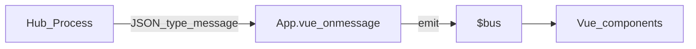

# WebSocket 协议目录说明

本目录存放由脚本从源码导出的协议表（CSV），以及本文档。**CSV 不逐行描述连接、重连、证书等**，只索引「已建立 WebSocket 之后」收发的 `type` 与 `message` 业务串；连接与收发细节以 [`src/App.vue`](../src/App.vue) 为准。

## 目录中的文件

| 文件 | 作用 |
|------|------|
| [frontend-to-backend-commands.csv](frontend-to-backend-commands.csv) | **浏览器 → Hub**：扫描 `sendMessage(...)` 等出站字面量；列含协议类型、消息前缀、静态示例、参数说明、与 MainWindow 对照、源文件路径等。 |
| [backend-to-frontend-messages.csv](backend-to-frontend-messages.csv) | **Hub / Process → 浏览器**：汇总 `QT_Confirm`、`Process_Command` 子类型、`QT_Return` 特判前缀与 `switch (messageType)` 各 case。列含 **解析规律**（当前解析方法）、**当前返回信息**（本帧携带的业务信息概要）、**参数含义**（辅助说明，完整语义见 case 内后续使用）。 |
| [unified-websocket-protocol.csv](unified-websocket-protocol.csv) | **统一总表**：同上，并含信封层、出站命令、高风险域等；**「解析规律」「参数含义」** 与入站表语义一致（解析方法 / 依后续使用推断），并含状态副作用、前端消费路径等，便于对照「参数其后怎么用」。 |

**生成方式**：三份 CSV 由 [`scripts/export-websocket-protocol-csv.py`](../scripts/export-websocket-protocol-csv.py) 自动生成，编码为 **UTF-8（带 BOM）**。修改前端协议约定后，请在 `apps/web-frontend` 目录下执行：

```bash
python3 scripts/export-websocket-protocol-csv.py
```

再提交更新后的 CSV。

---

## WebSocket 连接与收发（摘要）

实现细节以 [`App.vue`](../src/App.vue) 为准，以下为与脚本文档一致的摘要。

### URL

`getLocationHostName()`（约 2080–2086 行）：按当前页面协议选择 `wss` 或 `ws`，主机名为 `window.location.hostname`，端口为 **HTTPS → 8601**、**HTTP → 8600**。

### 连接

`new WebSocket(this.WebSocketUrl, [], wsOptions)`（约 2106 行）；`rejectUnauthorized` 等选项以源码为准。

### 发送

`sendMessage(type, message)` 组装 JSON（含 `type`、`msgid`、`message` 等），`JSON.stringify` 后 `websocket.send`。`QT_Confirm` 仅回执 `msgid`，与 `handleMessageResponse` 及发送队列配对。

### 接收

`websocket.onmessage` 中 `JSON.parse`，再按 `data.type` 分派到 `QT_Return`、`QT_Confirm`、`Process_Command` 等分支。

### 其他仓库中的客户端

- **Qt Hub**：`QUARCS_QT-SeverProgram` 中的 `websocketclient.cpp`
- **宿主 Process**：`QUARCS_Process` 中的 `websocketclient.cpp`

---

## 后端返回与 `message` 解析约定

### 如何阅读 `backend-to-frontend-messages.csv`

下表说明各列含义；其中 **解析规律**、**当前返回信息**、**参数含义** 三者关系见下文「三列关系」。

| 列名 | 含义 |
|------|------|
| 序号 | 行号索引 |
| 入站通道 | 顶层 `data.type` 或细分（如 `QT_Return_switch`、`QT_Return_special_prefix`、`Process_Command`） |
| 消息前缀 | `data.message` 内用于路由的前缀，或 `switch (messageType)` 的 `case` 标签 |
| 解析说明 | 一句话提示（格式、易错点） |
| **解析规律** | **当前的解析方法**：在 `App.vue` 中如何得到 `parts`、何时 `JSON.parse`、特判顺序、`split` / `join` 等 |
| **当前返回信息** | **本帧下行携带/传递了哪些业务信息**（事件通道、关键字段类型、状态摘要等）；脚本对部分行从 `$bus.$emit` 名与 case 首行注释自动摘要 |
| **参数含义** | 各段/字段语义的**辅助说明**；完整含义需根据该参数在 **解析之后** 的用法判定（赋值、`$bus`、子组件展示等），**以 `App.vue` case 及订阅处为准** |
| 后端用途待确认 | 预留，可与 Qt/Process 侧实现对照补全 |
| 后端发出格式 | 建议的下行 `message` 形态示例；示例里 **尖括号**（如 `<save|scan>`、`<ok|fail>`）表示该段为**枚举取值（取其一）**，与 [`App.vue`](../src/App.vue) 内联注释一致，**不是**要求发送尖括号字符 |

**推荐阅读顺序**：`消息前缀` → `后端发出格式` → **解析规律** → **当前返回信息** → **参数含义**；若仍不清晰，打开 `App.vue` 对应分支，并结合 **`$bus` 订阅组件**；多段组合语义还需与 **后端实际发送的字段组合** 对照理解。

**与统一总表**：同一条信号在 [unified-websocket-protocol.csv](unified-websocket-protocol.csv) 中的 **解析规律**、**参数含义** 与上表一致；**状态副作用**、**前端消费路径** 列有助于理解「参数在后续如何被消费」。

### 三列关系（解析规律 / 当前返回信息 / 参数含义）

1. **解析规律**：只回答「**怎么拆、按什么步骤解析**」。
2. **当前返回信息**：回答「**这一帧里大致带了什么业务信息**」（便于快速扫表）。
3. **参数含义**：表中为脚本摘要或 `QT_RETURN_PARAM_MEANING` 人工映射；**各段最终语义须结合其在 case 内及下游的用法**，不能仅凭本列孤立理解。

未在表中单独展开的细节（例如某字段在某一 Vue 组件内的最终展示）仍可能需结合 **`$bus` 订阅处** 阅读源码。

### 1. 信封层

业务载荷通常在顶层 JSON 的 `message` 字段（若存在）。应先根据 `type` 路由，再解析 `message` 字符串。

### 2. `parts[0]` 与冒号分段

在采用 **`':'` 分段** 的约定下，**第一段（`parts[0]`）为命令名或子类型**。

但不能对整段一律 `message.split(':')` 即当作最终语义：若载荷为 JSON、含管道符 `|`、Base64、或「首个冒号之后整段为 JSON」等情况，必须在 `App.vue` 中先按 **`startsWith` 特判**，或使用 **`indexOf(':')` + `substring`** 等方式处理（参见统一表中 `NetStatus|`、`DownloadManifest:` 等行及脚本中的 `build_special_qt_return_rows`）。

### 3. 载荷中额外的 `':'`

在已确定「命令名仅占第一段」时，**后续内容**应使用 **`slice` / `join` 还原**（例如 `parts.slice(1).join(':')`，或限制 `split` 次数），与 CSV 中「载荷可含额外冒号时需 join」的说明一致。

### 4. `$bus` 转发

若 `App.vue` 在解析后将数据 **`$bus.$emit`** 给子组件，**各参数在子组件中的最终含义**须看订阅处；入站表中「参数含义」仅为辅助，**完整语义以 case 内及 `$bus` 下游为准**。「当前返回信息」列中的 `$bus` 事件名便于定位。

### 5. `frontend_gap`

若统一表中 **`compatibility_status` 为 `frontend_gap`**，表示宿主侧可能发送，但当前前端可能**没有单独分支**；新实现时应显式处理或标注为有意忽略。

---

## 数据流示意



**说明**：`type` / `message` 的主要分叉与特判在 `App.vue`；经 `$bus` 之后的行为以各订阅组件为准。
